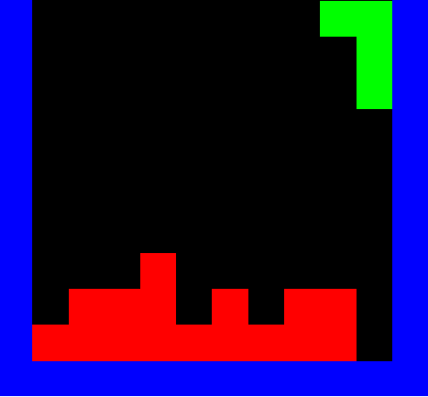

# tetris
Tetris written in Rust.


Partially (Mostly game logic) based on Tetris video by [OneLoneCoder](https://github.com/onelonecoder).

To play simply execute 
```shell script
$ cargo run
```



License: GNU GPLv3, see LICENSE